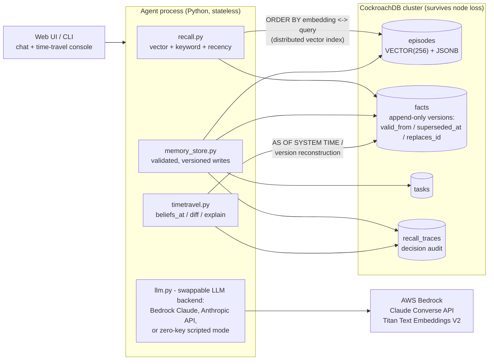
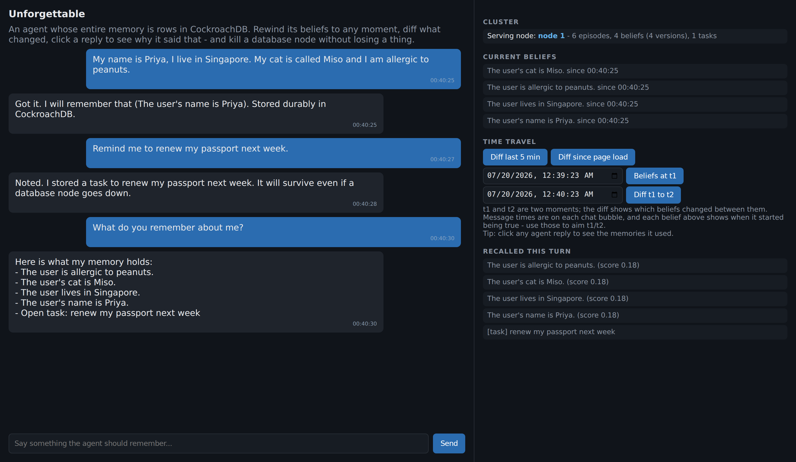
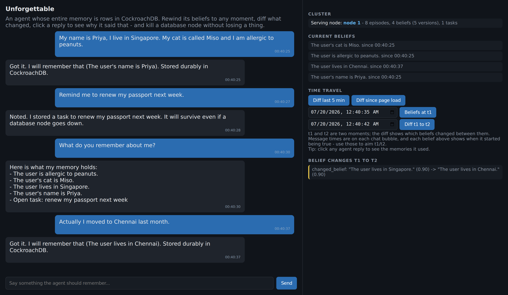
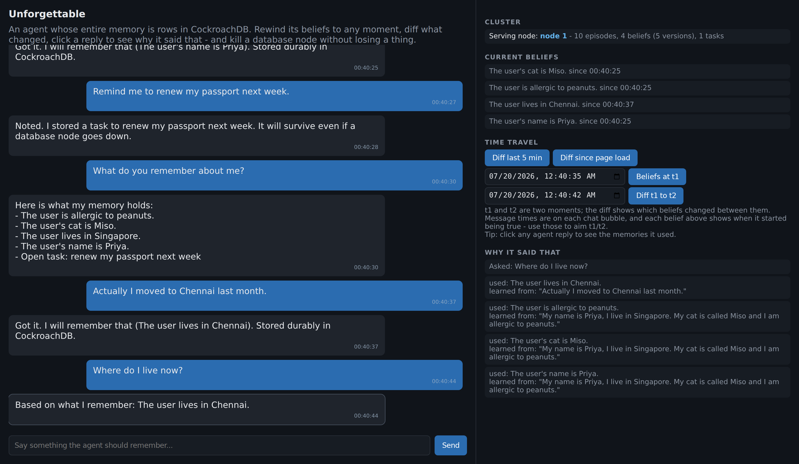
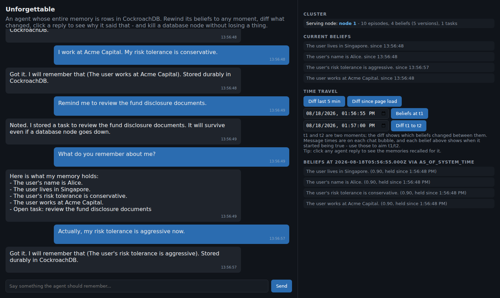

# Unforgettable

   

An AI agent whose memory you can rewind, diff, and audit - built for the
CockroachDB x AWS Hackathon: Build with Agentic Memory.

Unforgettable stores an agent's conversations, extracted beliefs, tasks,
and retrieval traces as SQL rows in CockroachDB. Beliefs are versioned,
never overwritten, so you can inspect what the agent believed at any past
moment, diff two belief states, trace a reply back to its supporting
memories - and kill a database node mid-conversation without losing a
thing.

Why that matters: a wealth-advisory chatbot tells a client on Monday
their portfolio matches a conservative risk tolerance, then on Thursday
recommends a high-volatility product. Compliance now has to reconstruct
what the agent believed about that client at each moment - today that
means grepping prompt logs with no ground truth. Here it is
`beliefs_at(Monday 10:02)` vs `beliefs_at(Thursday 15:41)`, a
`belief_diff` showing which belief flipped and which message taught it,
and `explain_reply` listing the memory rows behind the answer - from SQL.

Memory systems like MemGPT/Letta, Zep, and mem0 focus on what an agent
remembers now; Unforgettable adds the queryable, diffable belief history
- what it believed then, what changed, and why - built on CockroachDB's
`AS OF SYSTEM TIME` and multi-node resilience.

## Try It (For Judges)

Running locally in about 3 minutes, zero accounts or keys. Each step says
what it does:

    # 1) CockroachDB binary - one tarball, extracted into this directory
    #    (macOS/Windows tarballs: cockroachlabs.com/docs/releases)
    curl -s https://binaries.cockroachdb.com/cockroach-v25.2.2.linux-amd64.tgz | tar xz
    export PATH="$PWD/cockroach-v25.2.2.linux-amd64:$PATH"

    # 2) The project + pinned dependencies, in a project-local venv
    git clone https://github.com/RinzlerTron/unforgettable unforgettable && cd unforgettable
    ./run.sh setup

    # 3) The main demo: starts a local 3-node cluster, holds a
    #    conversation, SIGKILLs the node the agent is talking to, then
    #    proves row-exact memory survival and time travel across the
    #    failure. Ends with "RESULT: PASS" and tears the cluster down.
    ./run.sh chaos

Have Docker instead? `docker compose up --build` starts the web demo with
one command - the recipe is two short readable files
([Dockerfile](Dockerfile) + [compose.yaml](compose.yaml)), no hidden steps.

Then interactively (`./run.sh web`, after starting a node per
[docs/DEPLOYMENT.md](docs/DEPLOYMENT.md)) try:

Play the compliance scenario from the pitch above, as the client:

1. Onboard: "My name is Alice and I live in Singapore." Then
   "My risk tolerance is conservative. Remind me to review the fund
   disclosure documents." Ask "what do you remember about me?" - every
   stored belief shows when it started being true.
2. The belief flip an auditor cares about: "Actually, my risk tolerance
   is aggressive now." Open the time-travel panel: beliefs a minute ago
   vs now, and the diff showing conservative -> aggressive - with
   before/after confidence and the exact message that taught it.
3. Click any agent reply to see its decision audit: which memory rows
   were recalled into its context and which message taught each fact -
   the "what did it believe when it answered" record, from SQL.

Manual fallback: `./run.sh test` (50 tests, self-starts a disposable
CockroachDB node). Default mode is `MEM_LLM=off` - a deterministic
scripted client that exercises the full memory pipeline; set
`MEM_LLM=bedrock` for Claude on AWS Bedrock (see docs/DEPLOYMENT.md).

## Architecture

Every arrow into the cluster is plain SQL; the agent process holds no
state, so killing it (or the node under it) loses nothing. Detail and a
turn-by-turn sequence diagram in
[docs/ARCHITECTURE.md](docs/ARCHITECTURE.md).

## Results

| Metric | Value |
|---|---|
| Node killed mid-conversation | 0 memories lost; failover on the next statement (chaos demo asserts it) |
| Time travel | Belief state at any past moment; AS OF SYSTEM TIME inside the GC window, append-only version reconstruction beyond it |
| Decision audit | Every reply traceable to the memory rows recalled for it and the messages that taught them |
| Test suite | 50 tests against a real CockroachDB node |
| Keys needed for the local demo | none (scripted mode + local embeddings) |

The console in action (all four are live captures of `./run.sh web`):

*Teach it facts; every belief shows when it started being true.*

*"Actually, my risk tolerance is aggressive now" - the diff shows exactly
which belief flipped, with before/after confidence.*

*Click any reply: which memory rows were recalled for it, and which
message taught each fact.*

*Rewind to before the change: the agent's conservative-era belief state,
served by AS OF SYSTEM TIME.*

## Challenge Compliance

| Requirement / criterion | Where this submission delivers it |
|---|---|
| CockroachDB as persistent memory layer | All memory is SQL rows: `episodes`, `facts`, `tasks`, `recall_traces` (src/schema.sql); the agent process is stateless |
| CockroachDB tool 1: Distributed Vector Indexing | `VECTOR(256)` columns + partial prefix vector indexes on episodes and facts, shaped so the planner actually serves every recall from them; a test asserts the EXPLAIN plan says `vector search`, never `FULL SCAN` (src/db.py, src/recall.py, tests/test_recall_ranking.py) |
| CockroachDB tool 2: ccloud CLI | `tools/ccloud_deploy.sh` provisions the cluster, SQL user, and connection URL end to end |
| CockroachDB tool 3: Managed MCP Server | `tools/mcp_config.example.json` - ready-made config for read-only inspection of the memory cluster from Claude Code/Cursor (see docs/DEPLOYMENT.md) |
| AWS service: Amazon Bedrock | Claude via the Converse API + Titan Text Embeddings V2 (src/llm.py, src/embeddings.py); the hosted demo runs on EC2 under an instance role (docs/DEPLOYMENT.md) |
| Agentic Memory Design | Episodic + semantic + task memory with confidence and provenance; consolidation job distills episodes into beliefs; append-only versioning makes belief history first-class |
| Technical Implementation | Native AS OF SYSTEM TIME, vector indexes, JSONB provenance, SQLSTATE 40001 retries, multi-node client failover, transactional versioning |
| Real-World Impact | Memory audit and debugging: "what did the agent believe when it did that, and why" - the missing tool for agents in production |
| Production Readiness | Chaos-tested node failure, retry/backoff, validation before persist, schema bootstrap idempotent, secrets via env only (and never echoed by the status API), 50 tests |
| Creativity & Originality | Time-travel memory: rewind, belief diff, and per-reply decision audit built directly on CockroachDB primitives |

## Scope and future work

The current release supports one trusted operator with one memory
profile; the decision audit records what was recalled into the model's
context for each reply - its complete provenance - rather than the
model's internal reasoning. Future iterations:

- Multi-user isolation: authentication plus tenant-scoped storage,
  retrieval, history, and audit APIs.
- Arbitrary multi-valued subjects (today a fixed allowlist:
  `user.preference`, `user.health`, `conversation.summary`).
- Confidence decay over time for beliefs that are never reinforced.
- Wider zero-key extraction. Scripted mode uses conservative rule-based
  patterns; the Bedrock and Anthropic modes already do full
  natural-language extraction.

## Project structure

    src/
    ├── config.py        # paths, env, tunables (imported by all)
    ├── schema.sql       # memory tables            -> applied by db.py
    ├── db.py            # failover + retries       -> everything below
    ├── embeddings.py    # Titan / local embeddings -> memory_store, recall
    ├── extract.py       # rule-based facts/tasks   -> agent, consolidate
    ├── memory_store.py  # validated, versioned writes
    ├── recall.py        # vector + keyword + recency retrieval
    ├── timetravel.py    # AOST reads, belief diff, decision audit
    ├── consolidate.py   # episodes -> facts job
    ├── llm.py           # bedrock | anthropic | scripted
    ├── agent.py         # the turn loop            -> cli, web, chaos
    ├── chat_cli.py      # terminal chat
    └── web.py           # web chat + time-travel console
    tools/               # chaos_demo.py, ccloud_deploy.sh, MCP config
    tests/               # 50 tests + fixtures (real saved inputs)
    docs/                # ARCHITECTURE.md, DEPLOYMENT.md

## Author

Sanjay - CockroachDB x AWS Hackathon: Build with Agentic Memory, 2026
