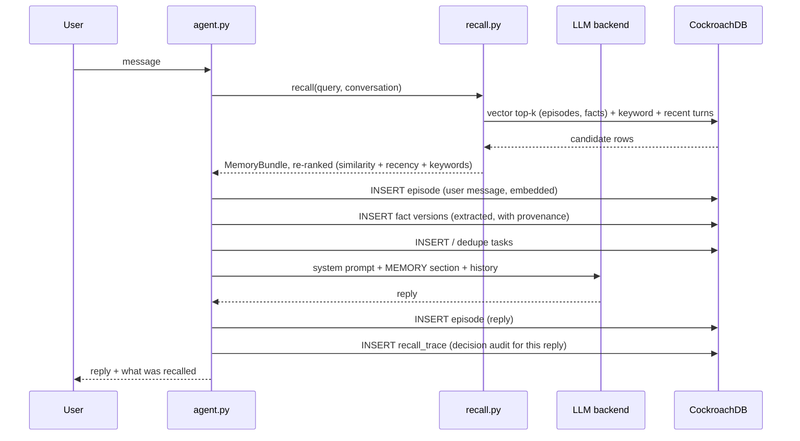

# Architecture

## Deployment view

Unforgettable is a stateless Python agent in front of a CockroachDB cluster.
Every piece of state - episodic memory, semantic beliefs, task state, and
the decision-audit trail - is a SQL row; the agent process holds nothing,
so processes can be killed, restarted, or scaled horizontally at will, and
a database node can die mid-conversation without losing a memory.

    +---------------------------+          +--------------------------------+
    |  Agent (FastAPI / CLI)    |          |  CockroachDB cluster           |
    |  - recall + rank          |  SQL     |  - episodes   (episodic)       |
    |  - fact/task extraction   |<-------->|  - facts      (semantic,       |
    |  - LLM: Bedrock/Anthropic |  wire    |    append-only versions)       |
    |    /scripted              |  proto   |  - tasks      (task state)     |
    |  - time-travel API        |          |  - recall_traces (audit)       |
    +------------+--------------+          |  VECTOR indexes, JSONB, AOST   |
                 |                         +--------------------------------+
                 v
    AWS Bedrock (Claude via Converse API, Titan embeddings)

- **Reference deployment**: agent on AWS (EC2, ECS Fargate, or App Runner -
  it is a single uvicorn process), CockroachDB Cloud Basic cluster on AWS
  provisioned by `tools/ccloud_deploy.sh` (ccloud CLI), Amazon Bedrock in
  the same region for the LLM and embeddings. See docs/DEPLOYMENT.md.
- **Judge deployment**: everything local - `cockroach` binary + `MEM_LLM=off`
  runs the identical code path with zero accounts or keys.
- **Cost**: CockroachDB Cloud Basic free tier + Bedrock pay-per-token
  (a demo conversation is a few cents); the agent itself fits the smallest
  instance available.
- **Scaling**: agent replicas are stateless; memory scales with the cluster.
  Vector search stays inside the operational database (distributed vector
  indexes), so there is no separate vector store to keep consistent.

## The memory model

Three memory types plus an audit trail, designed for CockroachDB:

| Table | Memory type | Design |
|---|---|---|
| `episodes` | Episodic | Verbatim conversation events. UUID PK, `VECTOR(256)` embedding, JSONB `meta`, `(conversation_id, created_at)` index for the short-term tail, vector index for cross-conversation recall. |
| `facts` | Semantic | **Append-only belief versions.** Each row has `valid_from` / `superseded_at` / `replaces_id`. Reinforcement writes a new version (merged provenance, max confidence); a contradiction on a single-valued subject supersedes the old belief - a recorded belief flip. Nothing is ever updated destructively. |
| `tasks` | Task state | Open/done/cancelled with JSONB payload, deduplicated on open titles. |
| `recall_traces` | Decision audit | For every reply: the query, and the exact fact/episode/task rows (with scores) the agent retrieved before answering. |

Every fact carries `provenance` (JSONB): the method that produced it
(turn extraction, LLM extraction, consolidation) and the episode ids that
taught it - so any belief traces back to the exact message it came from.

## One agent turn

Every step is a SQL round trip; the process could die between any two of
them and the memory written so far survives.

## Time travel (the headline)

`src/timetravel.py` exposes three operations, all pure SQL:

1. **beliefs_at(t)** - the belief state at any past moment. Two mechanisms:
   - `AS OF SYSTEM TIME` - CockroachDB-native historical reads: a
     consistent snapshot at timestamp `t`, no locks, served by any node.
     Used whenever `t` is within the MVCC garbage-collection window.
   - Version reconstruction - `valid_from <= t AND (superseded_at IS
     NULL OR superseded_at > t)` over the append-only version rows. Works
     for any moment since the agent was born, forever.
   The API reports which mechanism served the answer.
2. **belief_diff(t1, t2)** - classifies every change in the window:
   `learned` (new beliefs), `revised` (linked old/new versions through
   `replaces_id`, split into `reinforced` and `changed_belief`), and
   `retired`. This is how you see exactly which remembered fact flipped
   between a morning answer and an evening answer.
3. **explain_reply(episode_id)** - joins `recall_traces` back to `facts`
   and `episodes`: "the agent said X because it believed Y, which it
   learned from message Z at time T".

## Turn pipeline (data flow entry to exit)

    user text
      -> recall.py     hybrid retrieval: vector search (ORDER BY
                       embedding <-> query, served by partial prefix vector indexes; embeddings are unit-normalized so L2 order equals cosine order, and a test asserts the EXPLAIN plan says vector search, not FULL SCAN)
                       + keyword match + recent conversation tail,
                       re-ranked by 0.6*similarity + 0.2*recency
                       + 0.2*keyword_overlap, facts scaled by confidence
      -> memory_store  user episode row written (validated, embedded)
      -> extract/llm   durable facts + task intents extracted, written with
                       provenance to that episode (append-only versioning)
      -> llm.py        prompt = system + MEMORY section; Bedrock Claude,
                       Anthropic API, or the deterministic scripted client
      -> memory_store  assistant episode row written
      -> memory_store  recall trace written (decision audit)
      -> reply + full recall trace returned to the UI

Consolidation (`consolidate.py`) runs out of band: episodes older than 30
minutes are distilled into facts and a summary belief, then stamped
`consolidated_at` so the job is idempotent.

## Resilience mechanics

- `db.py` holds a list of node URLs. On a connection-level failure it
  reconnects to the next URL and retries the statement; on CockroachDB
  serialization retries (SQLSTATE 40001) it backs off and retries in place.
  Multi-statement writes (belief versioning) run in explicit transactions.
- With 3 nodes and replication factor 3, killing any one node keeps quorum;
  `tools/chaos_demo.py` proves it end to end and asserts memory integrity
  across the kill, including a time-travel read of the pre-kill belief
  state served by a surviving node.

## Connection map (full)

    src/
    ├── config.py        # paths, env, tunables, logging (imported by all)
    ├── schema.sql       # tables + indexes                -> applied by db.py
    ├── db.py            # failover + retries + schema     -> used by all below
    ├── embeddings.py    # Titan / local-hash embeddings   -> memory_store, recall
    ├── extract.py       # rule-based facts + task intents -> agent, consolidate, llm
    ├── memory_store.py  # validated writes, versioning    -> agent, consolidate
    ├── recall.py        # hybrid retrieval + ranking      -> agent
    ├── timetravel.py    # AOST reads, belief diff, audit  -> web, cli, chaos demo
    ├── consolidate.py   # episodes -> facts job           -> run.sh consolidate
    ├── llm.py           # bedrock | anthropic | scripted  -> agent
    ├── agent.py         # the turn loop                   -> cli, web, chaos demo
    ├── chat_cli.py      # terminal front-end
    └── web.py           # FastAPI chat + time-travel console
    tools/
    ├── chaos_demo.py             # 3-node cluster, kill node 1, assert memory
    ├── ccloud_deploy.sh          # provision CockroachDB Cloud via ccloud CLI
    └── mcp_config.example.json   # managed MCP server config for judges
